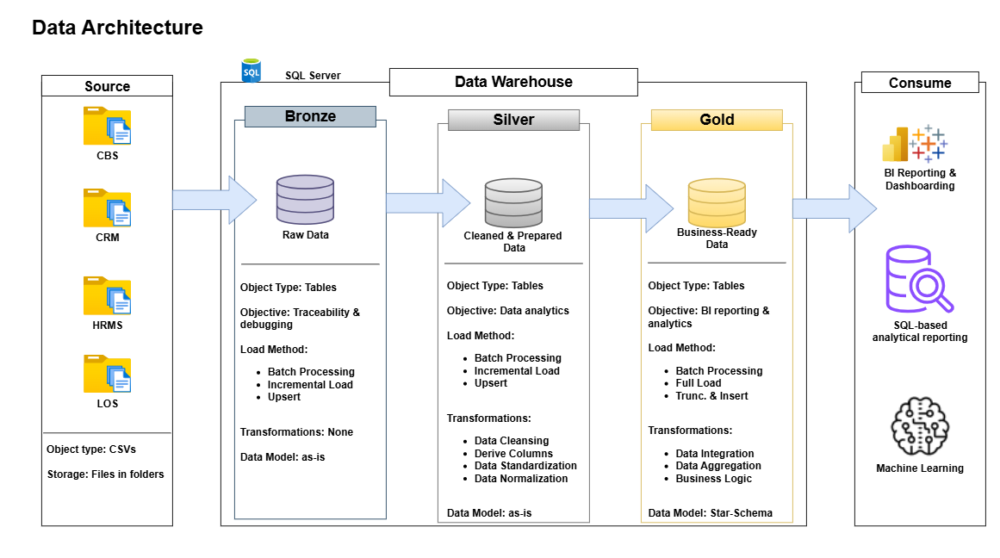

# Banking Datawarehouse — SQL Medallion Architecture

Welcome to my **SQL Server Data Warehouse Project**! This project is a fully hands-on, end-to-end **SQL Server Data Warehouse** built from
the ground up, from raw source data ingestion to business-ready analytics. It is designed to reflect the standards and practices of a 
real-world banking data engineering environment, covering every layer of the modern data stack: architecture design, ETL pipeline 
development, data modelling, and advanced analytical reporting.

The project is built on the **Medallion Architecture (Bronze → Silver → Gold)**, a widely adopted pattern in enterprise data warehousing 
that progressively refines raw data into clean, conformed, and business-ready information. Every design decision in this project, from 
schema naming conventions to stored procedure structure to load strategies is grounded in industry practice.

This is both a learning project and a portfolio piece. It demonstrates not just the ability to write SQL, but the ability to think like 
a data engineer: designing for traceability, performance, maintainability, and analytical value.

---

## Project Overview

A mid-sized fictional bank **First National Bank** operates across multiple internal systems that manage customers, accounts, 
transactions, loans, employees, and branches. Each system generates data independently, in its own format, on its own schedule. 
The goal of this project is to consolidate all of that data into a single, governed, analytically powerful Data Warehouse.

The warehouse ingests raw data from **four source systems**:

 Source System                      |      Abbreviation     | Data It Owns 
|-----------------------------------|-----------------------|-------------------------------|
| Core Banking System               | CBS                   | Accounts, Transactions, Branches 
| Customer Relationship Management  | CRM                   | Customers 
| Loan Origination System           | LOS                   | Loan Applications 
| Human Resource Management System  | HRMS                  | Employees 

Raw data arrives as **CSV flat file exports** — simulating the most common real-world integration pattern for batch ETL pipelines. Data 
quality issues are intentionally present across all source files, including NULL values, corrupted fields, duplicate records, orphan 
foreign keys, and anomalous values.

The warehouse is built entirely on **Microsoft SQL Server** using stored procedures, schemas, and T-SQL as the primary implementation 
language — no external orchestration tools, no notebooks, no Python. Pure SQL, end to end.

---

## Project Requirements

The following requirements define the scope and standards of this project.

**Data Engineering**
- Design and implement a multi-layer Data Warehouse using the Medallion Architecture (Bronze, Silver, Gold)
- Model source data across four independent systems into a unified, conformed dimensional model
- Implement a fully logged ETL pipeline using domain-grouped stored procedures — one per source system per layer
- Build a production-grade ETL logging and auditing framework that tracks every batch, every step, and every error
- Apply industry-standard load strategies per layer: Incremental Append (Bronze), MERGE/Upsert (Silver), Truncate & Reload (Gold)
- Implement SCD Type 2 on `dim_customer` to preserve historical changes in customer segment and risk band
- Enforce audit column standards across all layers for full data lineage traceability
- Handle source system deletions through soft-delete flags — Bronze is append-only and never truncated

**Data Analytics**
- Perform Exploratory Data Analysis (EDA) across all business domains: customers, accounts, transactions, and loans
- Build an advanced statistical analytics library implemented entirely in T-SQL — no external tools
- Cover seven statistical categories: descriptive statistics, distribution analysis, correlation, segmentation, time-series,
  risk & anomaly detection, and hypothesis testing
- Produce Gold layer tables that serve as the analytical foundation for BI reporting

**Standards & Quality**
- All database objects follow a defined naming convention documented in `/docs/naming_conventions.md`
- All tables carry audit columns appropriate to their layer
- Scripts are numbered sequentially and self-contained — executable in order without dependencies outside the repo
- The repository is structured to be navigable by any data engineer without prior context

---

## 01 Build Data Warehouse (Data Engineering)

### Data Architecture

The warehouse is built on the **Medallion Architecture**, implemented entirely within SQL Server. Data flows from source systems through 
three progressive layers before reaching the consumption layer.

* **Bronze**: Stores raw data as-is.
* **Silver**: Houses cleaned and prepared data.
* **Gold**: Houses business-ready data.

## 02. Analytics & BI Reporting (Data Analytics)

This section of the project is divided into two phases **Exploratory Data Analytics (EDA)** and **Advanced Data Analytics**.

### Objectives
Generate SQL and BI reports that draw insight into:

* Customer Segmentation
* Account Health
* Loan Portfolio

---
## Project Roadmap

- **Dataset generation**: Multi-source synthetic banking data (137,493 rows)
- **Project planning**: Architecture design, load strategy, naming conventions
- **Repository setup**: Structure, README, data dictionary, naming conventions
- **Phase 1**: DDL scripts — Bronze, Silver, and Gold layer table definitions
- **Phase 2**: ETL pipeline — domain-grouped stored procedures and logging framework
- **Phase 3**: Exploratory Data Analysis query library
- **Phase 4**: Advanced statistical analytics in T-SQL

---

## Tools & Technologies Used

* **Notion**: Project Planning
* **SQL Server**: Database engine that stores data.
* **SQL Server Management Studio (SSMS)**: Interface for interacting with SQL server.
* **Draw.io**: For designing the data architecture, data flow, integration model, and data model.
* **Git Hub**: For committing codes.
* **Tableau**: For data visualization.

---

## License
This project is licensed under **MIT License**. You are free to use, modify, or share with proper attribution.

---

## About Me
Hi there! I'm **Otusanya Toyib Oluwatimilehin**. I'm an aspiring **Data Engineer and Analyst** passionate about building reliable data pipelines, efficient data models, and generating data-driven business decisions. 

 **07082154436** 
 **toyibotusanya@gmail.com**
